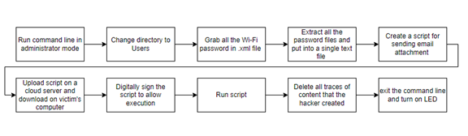
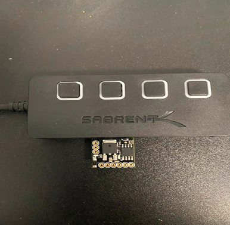
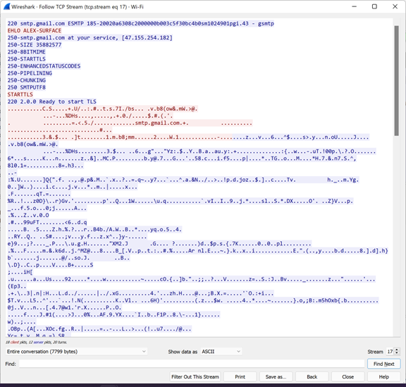

# USB Wi-Fi Detector 
by Benson Thong

## Project Description
<br/>This project is built to showcase the effectiveness of keystroke injection using the Attiny85 microcontroller. It is designed to act stealthy and infiltrate Wi-Fi credentials using the command line interface and powershell. The motivation to build this project is to understand onsite hacking is done and its efficiency compared to remote hacking. The project works when the onsite hacker inserts the Attiny85 USB board on the victim's Windows machine. Following this, command keystrokes are done to grab all Wi-Fi credentials existing in the machine then it will run a downloaded powershell script to send the extracted Wi-Fi credentials in a single text file via SMTP process to the attacker's gmail. 

<br/> This project provides a general understanding of powershell scripts, hardware hacking, commands targeting cmd and powershell, necessary firmware needed, and programming the Attiny85. Wireshark is used to capture and analyze network traffic to protect any data breached while initating the onsite hacking. This is to ensure that the program is not flawed. </br> 

### Hardware Used
- 4-Port USB hub 
  - Used to protect the USB port in an event of electrostatic discharge occurance.
- Attiny85 USB development board by DigiSpark
  - The Attiny85 provides a USB interface to the user as long as necessary firmware is installed.
  - It also provides a keystroke library to allow user to program and execute keystrokes at a fast pace without user touching the keyboard.
  
### Software Used 
- Arduino IDE
  - The development board manager needs to be installed by going to the Preferences tab and pasting http://digistump.com/package_digistump_index.json on the Additional Boards Manager URLs:
  - The Digispark board manager can be installed by going to Tools -> Boards Managers -> install Digistump AVR boards. 
  - Select the Digistump default board.
  - Arduino code can be found in ```USB-Wi-Fi-Detector\Wifi.ino``` and the powershell script can be found in ```USB-Wi-Fi-Detector\Wi-sendmsg.ps1```
- Installation of Firmware is found from ```https://github.com/digistump/DigistumpArduino/releases```
  - From the latest release of DigiStump Arduino, download ```Digistump.Drivers.zip``` and run the installation DPinst64.exe depending on the type of processor you have. 
  - In the case that the Attiny85 is not detected, Windows Device Manager will need to be analyzed to see if it is detected. The device detected will need to undergo a manual installation of the driver based on the directory inside the Digistump.Drivers.zip. 
  - If all else fails, the Attiny85 bootloader is not installed so the bootloader needs to be flashed.
## Project Algorithm 

<br/>This is a simple algorithm used to map how the Arduino IDE code works. This algorithm will only work in Windows OS and requires that the onsite hacker has administrative access to the victim's machine. </br>
## Project Setup


## Wireshark 
 
<br/> As shown, TLS encrypts the data being sent over SMTP to protect any information leak. </br>
